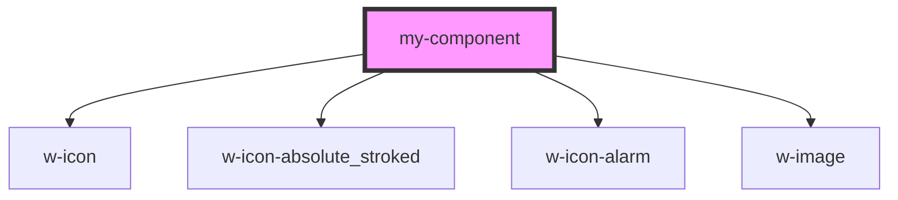

# my-component

<!-- Auto Generated Below -->

## Properties

| Property | Attribute | Description     | Type     | Default     |
| -------- | --------- | --------------- | -------- | ----------- |
| `first`  | `first`   | The first name  | `string` | `undefined` |
| `last`   | `last`    | The last name   | `string` | `undefined` |
| `middle` | `middle`  | The middle name | `string` | `undefined` |

## Dependencies

### Depends on

- [w-icon](../w-icon)
- [w-icon-absolute_stroked](../w-icon/icons)
- [w-icon-alarm](../w-icon/icons)
- [w-image](../w-image)

### Graph

----------------------------------------------

*Built with [StencilJS](https://stenciljs.com/)*
