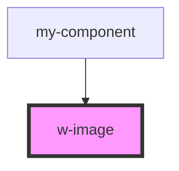

# my-component

<!-- Auto Generated Below -->

## Properties

| Property      | Attribute     | Description           | Type                                                       | Default     |
| ------------- | ------------- | --------------------- | ---------------------------------------------------------- | ----------- |
| `errorText`   | `error-text`  | Prop 错误文案             | `string`                                                   | `'加载失败'`    |
| `fit`         | `fit`         | Prop fit 图片填充格式       | `"contain" \| "cover" \| "fill" \| "none" \| "scale-down"` | `'none'`    |
| `lazy`        | `lazy`        | Prop lazy 是否懒加载       | `boolean`                                                  | `false`     |
| `placeholder` | `placeholder` | Prop placeholder 加载文案 | `string`                                                   | `'加载中...'`  |
| `src`         | `src`         | Prop src 图片链接         | `string`                                                   | `undefined` |

## Dependencies

### Used by

 - [my-component](../my-component)

### Graph

----------------------------------------------

*Built with [StencilJS](https://stenciljs.com/)*
